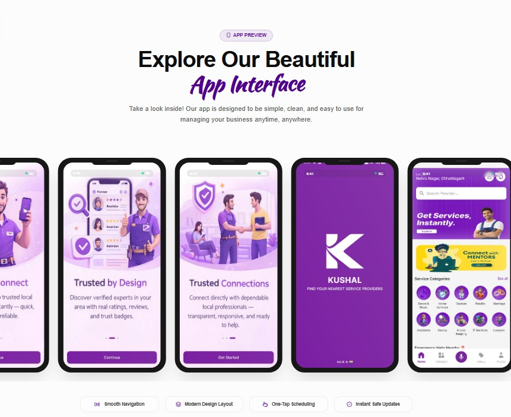
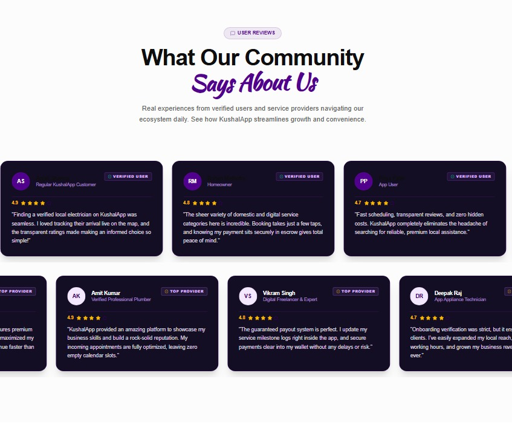

# KushalApp: Service Marketplace Platform

A modern, high-performance service marketplace designed to bridge the gap between skilled service providers and local clients. Built with a focus on speed, transparency, and a commission-free business model.

## 🚀 Key Features

*   **Zero Commission:** Professionals retain 100% of their earnings.
*   **Direct Interaction:** Facilitates open communication between providers and clients.
*   **Modern UI/UX:** Built with a premium, responsive "dark-theme" inspired aesthetic.
*   **Performance-Oriented:** Optimized animations using Framer Motion and GSAP.
*   **Real-time Ready:** Designed for seamless integration with backend service APIs.

## 🛠 Tech Stack

*   **Frontend:** React.js, Tailwind CSS
*   **Animation:** Framer Motion, GSAP
*   **Icons:** Lucide React
*   **Design System:** Custom CSS variables for consistent theming (Lavender/Purple accents)

## 📸 Project Showcase

*Below are previews of the current platform architecture.*

| Hero Interface | Application Showcase |
| :---: | :---: |
|  |  |

| Client Testimonials | Download Call-to-Action |
| :---: | :---: |
|  |  |
## 📦 Getting Started

### Prerequisites
- Node.js (v18+)
- npm or yarn

### Installation

1. Clone the repository:
```bash
   git clone [https://github.com/logixhunt24/kushal-web.git](https://github.com/logixhunt24/kushal-web.git)

Install dependencies:

Bash
   npm install
Run the development server:

Bash
   npm run dev
🎨 Design Philosophy
The UI follows a Brutalist Editorial approach combined with System-Dashboard utility, focusing on negative space, bold typography, and clear, actionable feedback loops.

👨‍💻 Developed by
Shristi Kumari

Frontend Engineer & Software Developer

Specializing in scalable web architecture and high-end interactive UI.

Built with precision for the future of digital services.


---

